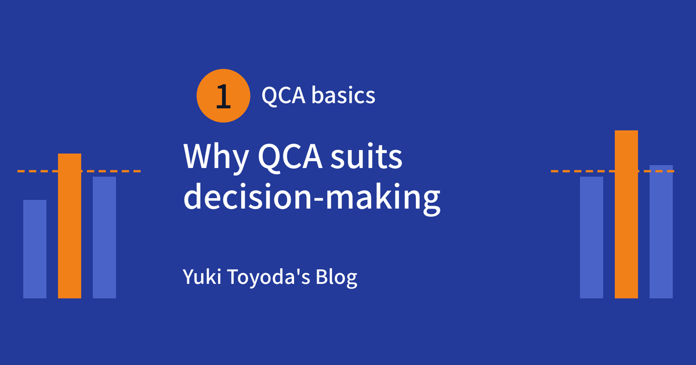
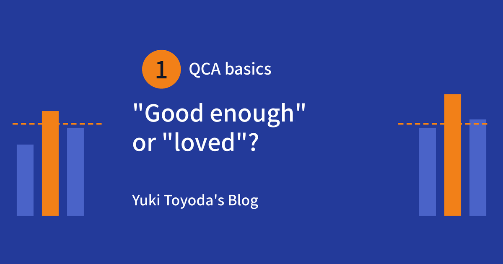
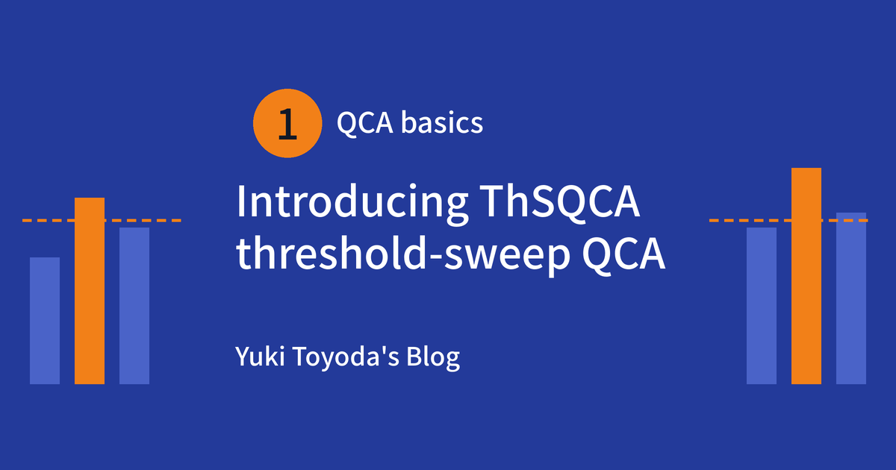
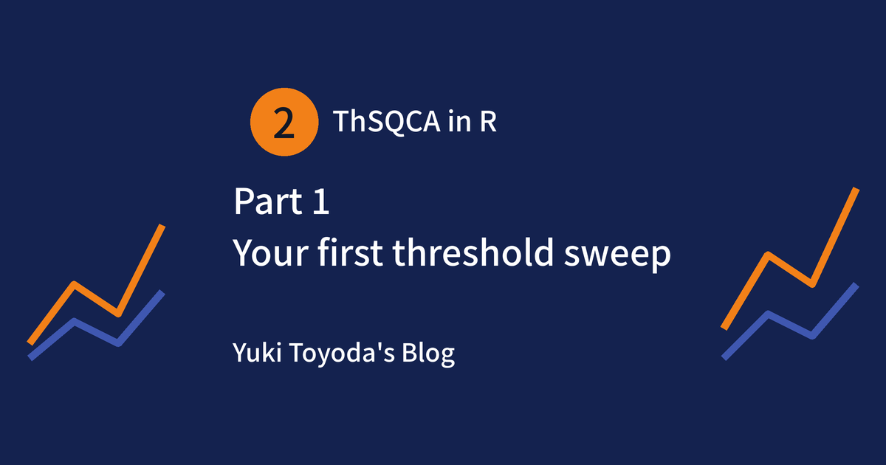
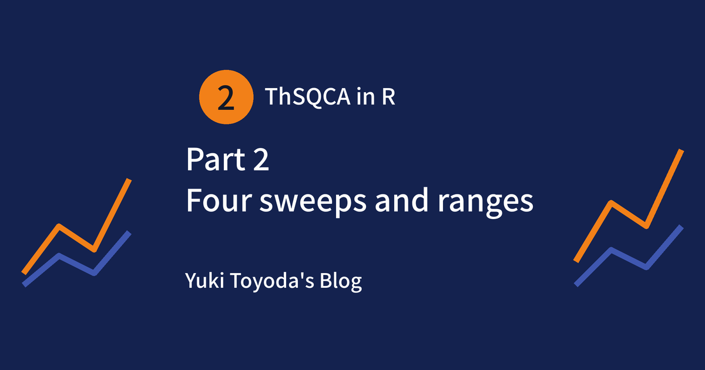
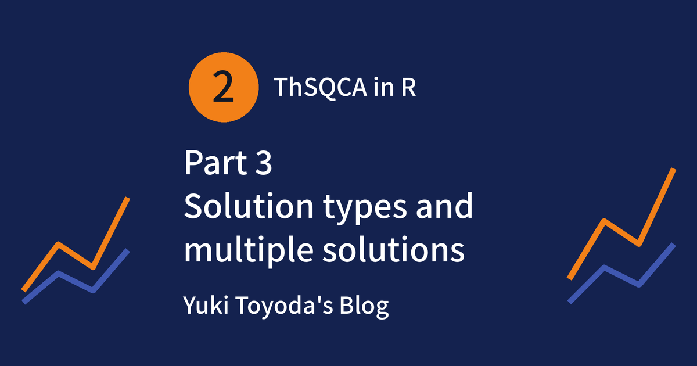
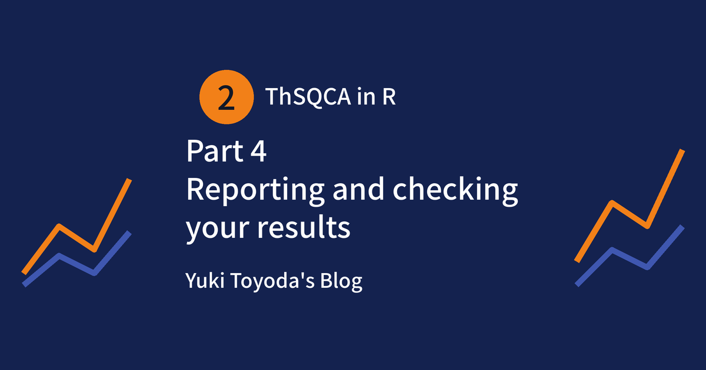
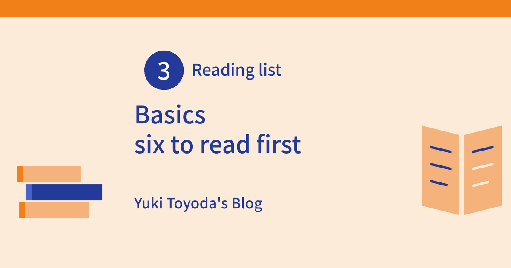
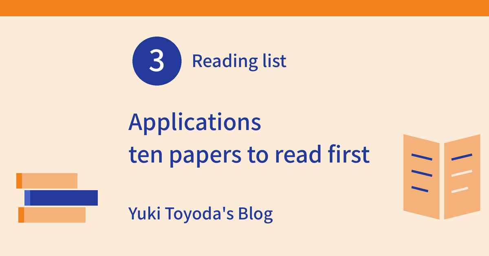

::: {.intro}
Notes on the **ThSQCA** R package, qualitative comparative analysis, and hands-on web tools for marketing research.

[New here? Start here](start-here.qmd){.btn .btn-primary .btn-sm}
[日本語の方はこちら](ja/index.qmd){.btn .btn-outline-primary .btn-sm}
[ThSQCA on CRAN](https://cran.r-project.org/package=ThSQCA){.btn .btn-outline-primary .btn-sm}
:::

The ten articles below are the core of this site. They are arranged in reading order, so you can start at the top and go down. (Posts about R are also shared via R-bloggers.)

## 1. Get to know QCA and the threshold idea

No R needed. Why QCA suits decisions, why the threshold matters, and the package that makes it an object of analysis.

<a class="toc-card" href="posts/welcome/index.html">
1
Welcome

Notes on threshold-sweep QCA, the ThSQCA R package, and data analysis for marketing research.

</a>
<a class="toc-card" href="posts/why-qca-decisions/index.html">
2
Why QCA suits decision-making: looking for &quot;recipes&quot; instead of single effects

Marketing actions work in combination. Qualitative comparative analysis (QCA) looks for the recipes that are enough for an outcome. Here is how it differs from regression, and what to watch for.

</a>
<a class="toc-card" href="posts/qca-for-marketers/index.html">
3
Is &quot;good enough&quot; the same goal as &quot;loved&quot;? A marketer&#x27;s guide to threshold-sweep QCA

A brand manager&#x27;s target level changes which strengths matter. Threshold-sweep QCA shows how the winning combination changes as the bar rises.

</a>
<a class="toc-card" href="posts/introducing-thsqca/index.html">
4
Introducing ThSQCA: threshold-sweep QCA in R

ThSQCA is an R package that reruns a QCA analysis across a range of thresholds and records how the sufficiency solutions change.

</a>

## 2. Learn ThSQCA in R

A four-part series for beginners, using practice data and running code. Read it in order.

<a class="toc-card" href="posts/thsqca-beginners-1/index.html">
5
ThSQCA for beginners, part 1: your first threshold sweep

A step-by-step introduction to threshold-sweep QCA in R. No data needed: we simulate a small data set and run a first sweep with ThSQCA.

</a>
<a class="toc-card" href="posts/thsqca-beginners-2/index.html">
6
ThSQCA for beginners, part 2: the four sweeps and how to choose a range

Sweep the outcome, one condition, several conditions, or both. We run all four sweeps on a practice data set and discuss how to choose a threshold range you can defend.

</a>
<a class="toc-card" href="posts/thsqca-beginners-3/index.html">
7
ThSQCA for beginners, part 3: solution types and multiple solutions

Complex, parsimonious, and intermediate solutions explained with a small example, and what to do when a threshold yields more than one minimal solution.

</a>
<a class="toc-card" href="posts/thsqca-beginners-4/index.html">
8
ThSQCA for beginners, part 4: reporting and checking your results

Turn a threshold sweep into a report: generate_report(), configuration charts, a check against the QCA package, and a short checklist for reporting.

</a>

## 3. Reading lists

Where to read next: the standard readings for learning QCA, then papers that use it in marketing and management.

<a class="toc-card" href="posts/reading-list-basics/index.html">
9
Papers and books for getting to know QCA: six to read first (basics)

A short, goal-based list of the papers and books worth reading first if you want to understand how QCA thinks.

</a>
<a class="toc-card" href="posts/reading-list-applied/index.html">
10
QCA in marketing and management: ten papers to read first (applications)

Papers that use QCA in marketing and management, the theoretical background from management and organization research, practical guides, and papers on the threshold.

</a>

