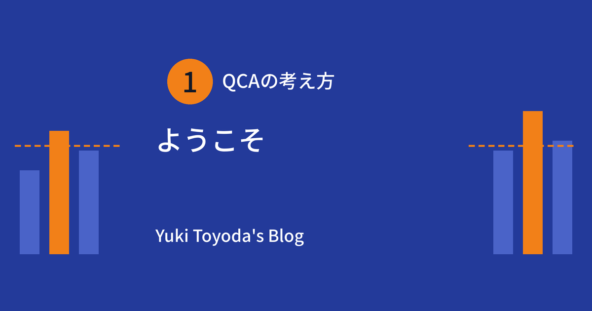
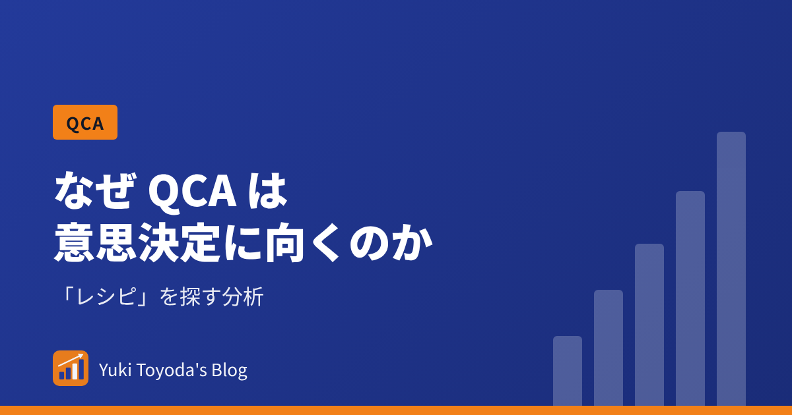
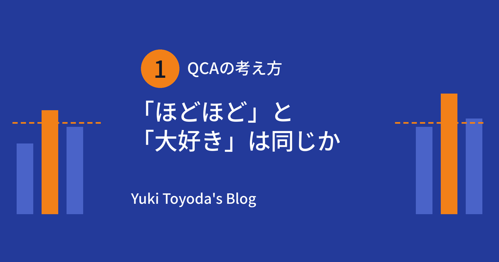
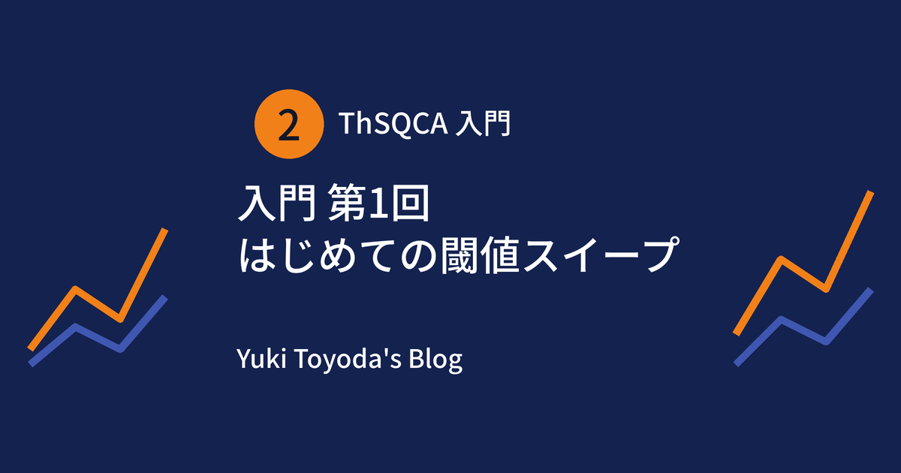
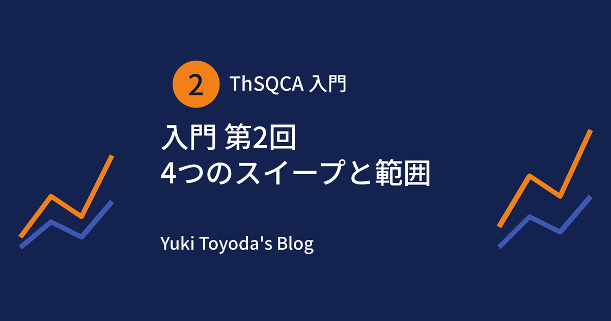
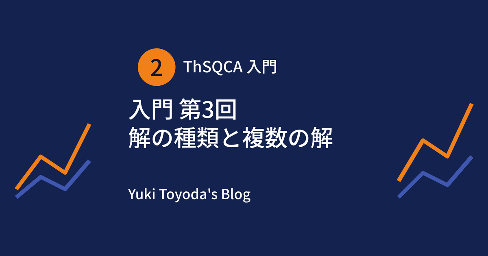
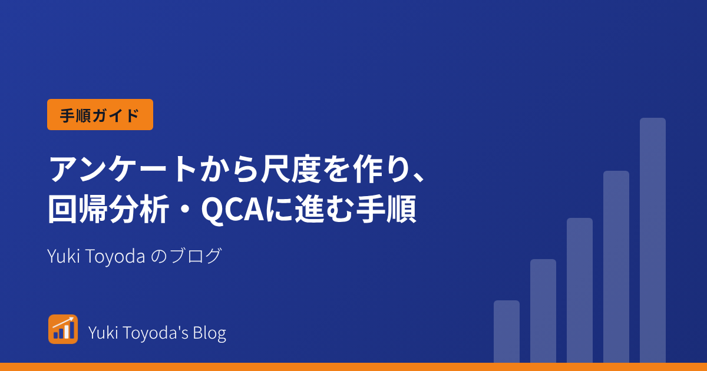

::: {.ja-nav}
[日本語版トップ](index.qmd) | [はじめに](start.qmd) | [分析ツール](tools.qmd) | [ThSQCA](software.qmd) | [紹介](about.qmd) | [English](../index.qmd)
:::

::: {.intro}
**ThSQCA** パッケージ、質的比較分析(QCA)、マーケティング調査のためのWebツールについて書いています。

[はじめての方へ](start.qmd){.btn .btn-primary .btn-sm}
[ようこそ](articles/welcome/index.qmd){.btn .btn-outline-primary .btn-sm}
[分析ツール](tools.qmd){.btn .btn-outline-primary .btn-sm}
[English](../index.html){.btn .btn-outline-primary .btn-sm}
:::

下の記事が、このサイトの中心です。読む順に並べてあります。上から順に読んでください。

## 1. QCA と「閾値」の考え方を知る

R は要りません。なぜ QCA が意思決定に向くのか、なぜ閾値が大切なのか、そして、閾値を分析の対象にするパッケージを紹介します。

<a class="toc-card" href="articles/welcome/index.html">
1
ようこそ

閾値スイープQCA、Rパッケージ ThSQCA、マーケティング研究のためのデータ分析について、ノートを集めたブログです。

</a>
<a class="toc-card" href="articles/why-qca-decisions/index.html">
2
なぜ QCA は意思決定に向くのか: 「単独の効果」ではなく「レシピ」を探す分析

施策は組み合わせで動かします。質的比較分析(QCA)は、成果に十分な「レシピ」を探す分析です。回帰分析との違いと、使うときの注意点を整理します。

</a>
<a class="toc-card" href="articles/qca-for-marketers/index.html">
3
「ほどほど」と「大好き」は、同じ目標でしょうか。マーケターのための閾値スイープ QCA

ブランド・マネージャーの目標水準によって、効く強みは変わります。閾値スイープ QCA で、基準を上げたときに勝ちパターンがどう変わるかを見ます。

</a>
<a class="toc-card" href="articles/introducing-thsqca/index.html">
4
ThSQCA の紹介: Rで閾値スイープQCAを行う

ThSQCA は、QCA の分析を閾値の範囲全体で繰り返し、十分条件の解がどう変わるかを記録する R パッケージです。

</a>

## 2. R で ThSQCA を使ってみる

初心者向けの全4回です。練習用データで、実際にコードを動かします。順に読んでください。

<a class="toc-card" href="articles/thsqca-beginners-1/index.html">
5
ThSQCA 入門 第1回: はじめての閾値スイープ

Rで閾値スイープQCAを、順を追って学びます。データは要りません。小さな練習用データを作り、ThSQCAで最初のスイープを実行します。

</a>
<a class="toc-card" href="articles/thsqca-beginners-2/index.html">
6
ThSQCA 入門 第2回: 4つのスイープと、範囲の決め方

アウトカム、1つの条件、複数の条件、その両方をスイープします。練習用データで4つのスイープをすべて実行し、擁護できる閾値の範囲の決め方を考えます。

</a>
<a class="toc-card" href="articles/thsqca-beginners-3/index.html">
7
ThSQCA 入門 第3回: 解の種類と、複数の解

複雑解、倹約解、中間解を小さな例で説明します。1つの閾値に最小解が複数あるときの扱いも見ます。

</a>
<a class="toc-card" href="articles/thsqca-beginners-4/index.html">
8
ThSQCA 入門 第4回: 結果の報告と確認

閾値スイープを報告にまとめます。generate_report()、構成図、QCAパッケージとの照合、報告のための短いチェックリストを扱います。

</a>

## 3. 文献リスト

次に読むもの: QCA を学ぶための基本文献と、マーケティング・経営学での応用例です。

<a class="toc-card" href="articles/reading-list-basics/index.html">
9
QCA を知るための論文と本: 最初に読む 6 点(基礎編)

QCA の考え方をつかむために、最初に読む価値のある論文と本を、目的別に紹介します。

</a>
<a class="toc-card" href="articles/reading-list-applied/index.html">
10
マーケティング・経営学で QCA を使った論文: 最初に読む 10 本(応用編)

マーケティングと経営学で QCA が使われた論文、経営・組織研究の理論的な背景、実務ガイド、しきい値の扱いを、目的別に紹介します。

</a>

## 4. リサーチ手法と手順ガイド

調査から分析までの手順を、Rの例で1本ずつ示します。今後、ほかの手法も加えていきます。

<a class="toc-card" href="articles/scale-to-regression/index.html">
11
アンケートから尺度を作り、回帰分析・QCAに進む手順

「ブランド信頼」のような複数項目の概念を、理論から定義し、因子分析とαで検討し、下位尺度にして回帰分析やQCAに使うまでの手順を、Rの例で示します。

</a>

